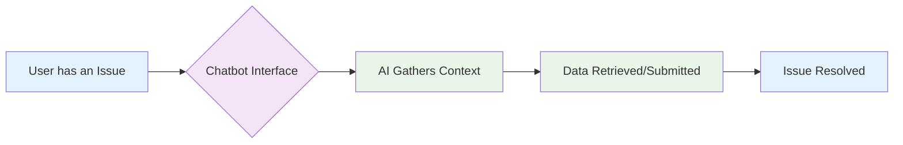

# Pillar 2: Enhance Interaction

<h2>The Problem</h2>
<ul>
<li>Navigating multiple systems is hard</li>
<li>Frustrating user interfaces abound</li>
<li>Challenges for new employees</li>
</ul>

<h2>The Solution</h2>
<ul>
<li>Replace UIs with a chatbot</li>
<li>Users express requests naturally</li>
<li>AI intelligently gathers information</li>
</ul>

<h2>User Experience</h2>
<ul>
<li>Acts as an intelligent form</li>
<li>Interface is always consistent</li>
<li>Offers a better experience</li>
</ul>

