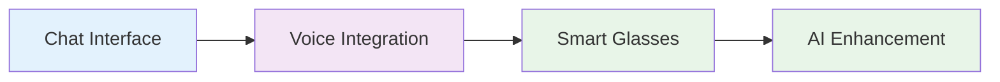

# Implementation Roadmap

## Phase 1: Core Interface
- Deploy basic chat interface
- Integrate voice recognition
- Implement form auto-generation

## Phase 2: Field Integration
- Smart glasses for field workers
- Hands-free documentation
- Automated report creation

## Phase 3: AI Enhancement
- Predictive maintenance alerts
- Proactive issue identification
- Automated workflow optimization

