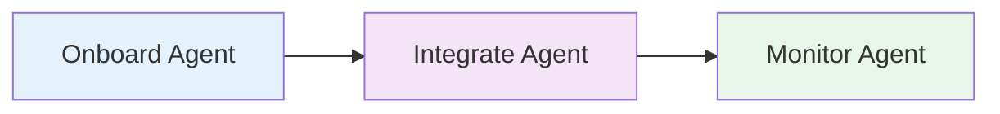

# Implementation Roadmap

## Phase 1
- Create knowledge base
- Onboard triage agent 

## Phase 2
- Integrate chat interface
- Deploy triage agent
- Monitor triage agent

## Phase 3
- Integrate systems
- Improve visibility
- Onboard new agents?

