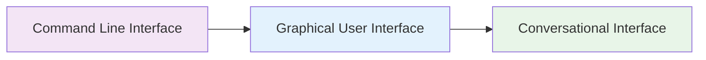

# The Market Shift

## Interface Evolution
- Command line to GUI to conversation
- Each shift democratizes technology
- Reduces learning curve dramatically

## User Expectations
- 62% prefer conversational interfaces
- Consumer experiences shape B2B demands
- Form fatigue driving interface change

## Market Readiness
- AI technology now enterprise-ready
- 84% of enterprises using conversational AI
- First-mover advantage window closing

