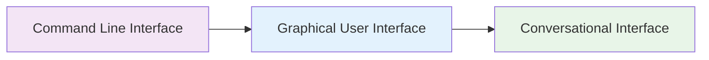

# The Market Shift

## Interface Evolution
- Command line to GUI
- GUI to Chatbot
- No learning curve

## User Expectations
- Expectations have changed
- Reshaped B2B demands
- Want chat driven experiences

## Market Readiness
- High interest
- Heavy saturation
- No clear leader

<!--
People want to have more sophisticated experiences with technology. But they don't want to click more buttons to get there. 

The only solution is via a conversational UI as the primary input source and a GUI as a response output source.
-->
