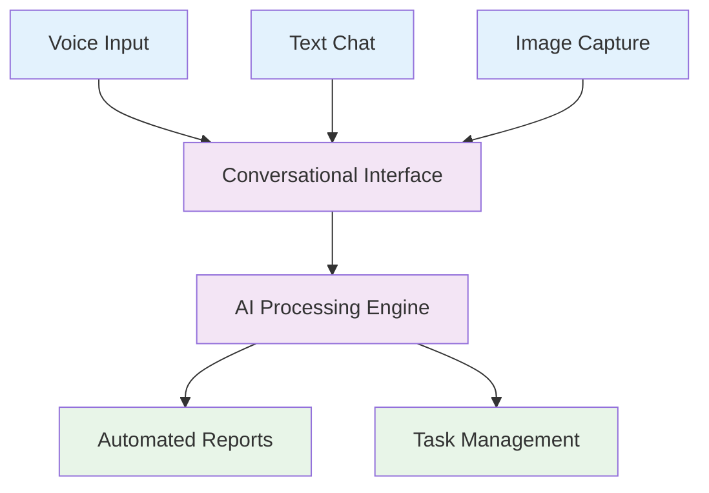

# Our Solution

::right::

## Natural Interaction
- Voice, text, and image inputs
- Zero learning curve interface
- Context-aware conversations

## AI-Powered Processing
- Automatic data structuring
- Real-time documentation
- Smart workflow automation

## Seamless Integration
- Smart glasses compatibility
- Mobile-first design
- Legacy system connections

