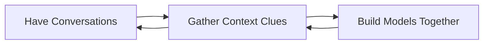

# Less Technology, Better Experiences

  

## Engage
- Forms, Chat and GenAI
- Forms are conversations
- Forms collect context

## Listen
- Guide content collection
- Document in real time

## Document
- Visual process models
- Conversational operating procedures
- Automated workflows

