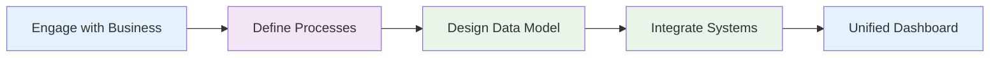

# Pillar 1: Understand and Integrate

## Process
- Catalog business processes and systems
- Design process models and data models
- Integrate business systems

## Outcome
- Establish unified single source of truth.
- Enable self-service reporting for all stakeholders
- Capture end to end business lifecycle

## Disruption? 
- No change to current processes
- A complete end-to-end business view for unified reporting.
- Allows users to access all reports through one place.

