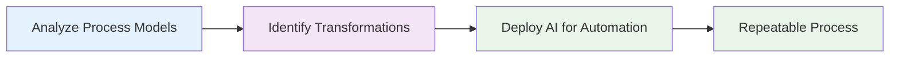

# Pillar 3: Scientific Method

## Process
- Analyze process models first
- Identify data transformation steps
- Deploy AI to automate tasks

## Applications
- Transcription and summarization
- Data movement and transfer
- Simple transformations

## Insights
- Target specific process step types
- Creates refined, repeatable value

