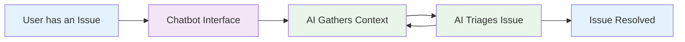

# Pillar 2: Remove Technology

## The Problem
- Multiple systems
- Information overload
- Hard to onboard

## The Solution
- Replace clicking with talking
- Users speaks naturally
- AI Forms

## User Experience
- Intelligent form
- Interface is always consistent
- Offers a simpler experience

