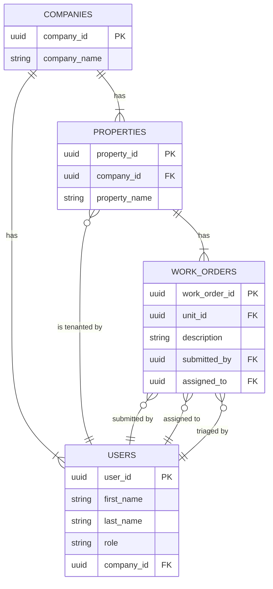

# Domain Model

  

::right::

## Table of Contents

<Toc text-sm minDepth="1" maxDepth="2" />

<!--
The focus is on the interactions between users and tickets.

We are re-imagining how users interact with tickets. Chat. 

The next-gen of apps are chat windows?!
-->
